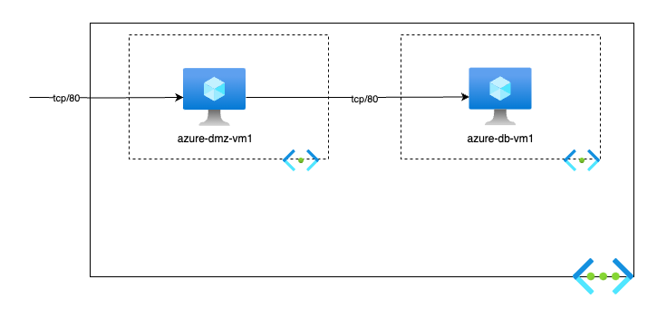

# Simple-2Tier-App-with-no-LB
Simple topology with 2-Tier application (DMZ + backend) with no load balancer

Tested on Terraform 1.9 \
Tested on AzureRM Terraform Provider 4.9.0
Tested on AzureCLI 2.65.0

### Prerequisites
You must have [Azure CLI](https://learn.microsoft.com/en-us/cli/azure/install-azure-cli#install) installed.
